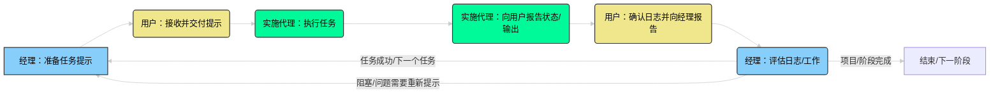
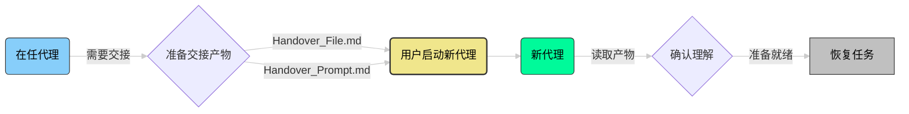
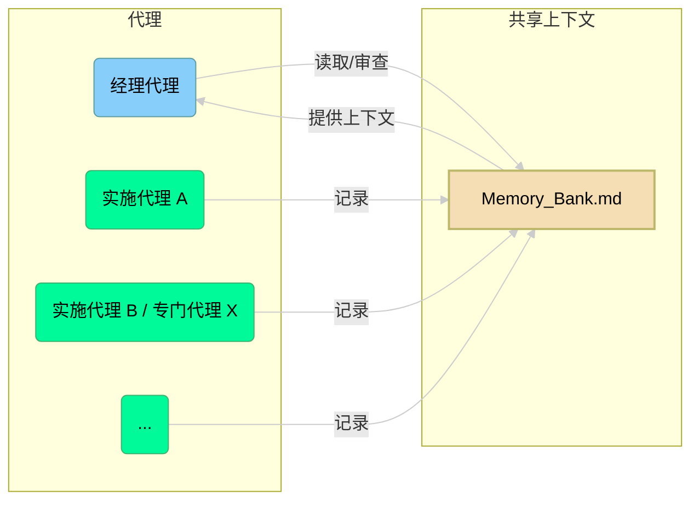

# APM 工作流程概述

本文档使用 Mermaid 图表对代理项目管理 (APM) 框架内的关键流程和交互进行了可视化概述。它补充了其他文档文件中的详细文本解释。

## 核心 APM 周期

此流程图说明了 APM 项目中任务管理的主要生命周期，突出了用户、经理代理和实施代理之间的协作。

**说明：**

1.  **经理代理**准备`任务分配提示`（通常由用户输入/审查）。
2.  **用户**接收此提示并将其交付给指定的**实施代理**。
3.  **实施代理**执行分配的任务。
4.  **实施代理**向**用户**报告其状态、任何输出或阻塞。
5.  **用户**确认是否/如何记录工作，并将此信息连同代理的报告一起转发给**经理代理**。
6.  **经理代理**评估已记录的工作和报告的状态。
7.  根据评估，周期要么循环回到**经理**准备下一个任务，要么解决问题，要么结束当前阶段/项目。

## 交接协议流程

此流程图显示了当需要更换代理时（例如，由于上下文限制）转移上下文的高级过程。

**说明：**

1.  **在任代理**（或用户/经理）确定需要交接。
2.  准备必要的交接产物（用于上下文的 `Handover_File.md`，用于初始化的 `Handover_Prompt.md`）（通常由经理或即将离任的代理在帮助下准备）。
3.  **用户**使用准备好的产物启动**新代理**实例。
4.  **新代理**处理交接上下文。
5.  **新代理**向**用户**确认其理解。
6.  一旦确认，**新代理**将接管并恢复项目任务。

## 内存库概念

此图显示了多个代理如何为中央内存库做出贡献并从中读取，其灵感来自可视化布局。

**说明：**

*   所有执行任务的代理（**实施代理 A**、**实施代理 B / 专门代理 X** 等）将其结构化日志写入中央**内存库**。
*   **经理代理**从**内存库**中读取以审查工作、跟踪进度并维护整体项目上下文。
*   **内存库**有效地为**经理代理**的协调和规划功能提供上下文。

这些图表为了解 APM 框架内的流程和交互提供了简化的可视化指南。有关每个组件和过程的详细说明，请参阅此 `/docs` 目录中的其他文档以及 `/prompts` 目录中的提示指南。
